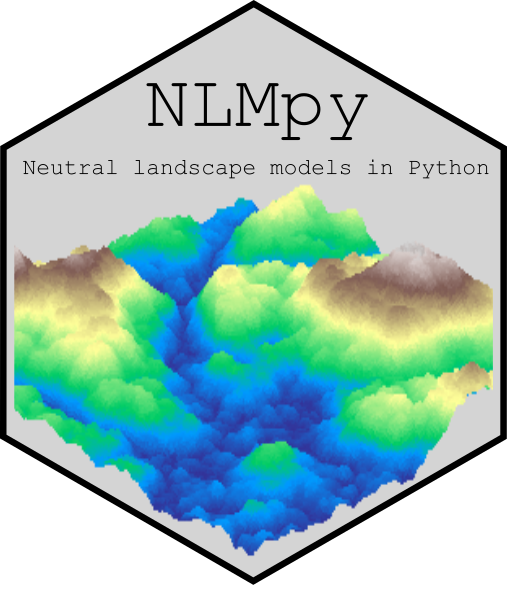

# NLMpy 

`NLMpy` is a Python package for the creation of neutral landscape models that 
are widely used by landscape ecologists to model ecological patterns across 
landscapes.

NLMpy aims to provide several advantages over existing NLM software:

* it is open-source so it can be easily adapted or developed for specific modelling requirements.
* being cross-platform it can be used on any computer system.
* it brings together a much wider range of NLM algorithms, including some that are not available elsewhere.
* it can be combined with geographic information system (GIS) data.
* it enables novel combinations and integrations of different NLM algorithms.
* it can be embedded into larger modelling frameworks based on software that is capable of executing a Python script.  


## Citation

If you use `NLMpy` in your research we would be very grateful if
you could please cite the software using the following software paper:

[Etherington TR, Holland EP, O'Sullivan D (2015) NLMpy: a Python software package for 
the creation of neutral landscape models within a general numerical framework. Methods in 
Ecology and Evolution 6:164-168](https://besjournals.onlinelibrary.wiley.com/doi/full/10.1111/2041-210X.12308)

## Community guidelines

We very much welcome input from others\! If you find a bug, need some
help, or can think of some extra functionality that would be useful,
please raise an
[issue](https://github.com/tretherington/nlmpy/issues). Better
still, please feel free to fork the project and raise a pull request if
you think and can fix a bug, clarify the documentation, or improve the
functionality yourself.

## Installation

## Dependencies

## Quick examples

Using NLMpy to create and export a midpoint displacement NLM can be achieved with 
only three lines of code:

```python
from nlmpy import nlmpy
nlm = nlmpy.mpd(nRow=50, nCol=50, h=0.75)
nlmpy.exportASCIIGrid("raster.asc", nlm)
```

## New developments

Having forked the project into manaakiwhenua the following have been (or are being!) added:

### Done:
* additional NLMs; waveSurface, perlinNoise

### Doing:
* numba integration to leverage jit compliation where useful
* general coding improvements to speed slow functions up
* error check and handling

### To do:
* wiki pages containing more detailed examples